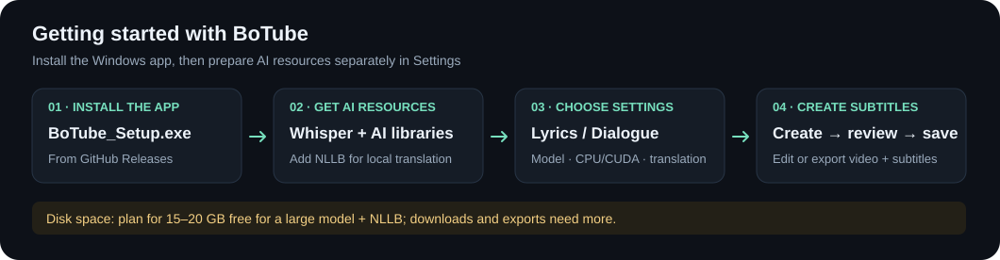

# BoTube · AI Media Player

[Tiếng Việt](README.md) · **English**

BoTube is a Windows music and video player with a media library, downloads, AI subtitle generation, translation, and subtitle editing. Its interface is built with Python and PySide6. Install the application with `BoTube_Setup.exe`, then download the AI libraries and models separately in Settings.

This README describes the latest version with **Lyrics** and **Dialogue / Film** modes. Older releases may not include all the features below. The application interface currently uses Vietnamese; instructions include the corresponding button labels where needed.


*This illustration uses the application's actual UI components with an empty playlist. It contains no personal music library or user data.*

## Features

- **Media playback:** folder-based library, search, For You page, playback queue, shuffle, repeat, fullscreen, and mini player.
- **AI subtitles:** language detection and transcription with faster-whisper, running on a CPU or NVIDIA GPU.
- **Translation:** local translation with NLLB-200 or online translation through Google Gemini, OpenAI, and Claude. Choose a model for the selected provider in Settings.
- **Subtitle display:** show the original text, English, Vietnamese, or a combination. Customize fonts, colors, position, and optional effects, including shuriken, stars, petals, typography, and hiding text after a sweep.
- **Subtitle editing:** edit text and timestamps; import/export JSON, SRT, and ASS. The AI generation flow also exports the original transcription as SRT and LRC.
- **Video export with subtitles:** burn the displayed subtitles into a video, with controls for canvas, aspect ratio, resolution, FPS, and export quality.
- **Audio:** remembered volume, loudness normalization between tracks, and optional sound presets, including headphone presets.
- **Video and music downloads:** powered by yt-dlp, with format and quality selection in the download interface.

The library currently scans `.mp3`, `.mp4`, `.mkv`, `.wav`, `.mov`, and `.avi` files. Playback of a particular file also depends on its codecs and available decoders.

## Getting started

### Install with BoTube_Setup.exe

**[Download BoTube_Setup.exe](https://github.com/Diablo-Loc/App-AI-media-player/releases/latest/download/BoTube_Setup.exe)** · [Browse releases](https://github.com/Diablo-Loc/App-AI-media-player/releases)

1. Open **Releases**, choose a version, and download `BoTube_Setup.exe` from **Assets**.
2. Run the installer, complete the usual Windows installation steps, and launch BoTube from its shortcut.
3. **Before generating AI subtitles for the first time**, open **Tùy chỉnh** (Settings) → **Tải / Cập nhật Resource AI (Thư viện & Model)** (Download / Update AI Resources). Choose a Whisper model and click **Bắt đầu cài đặt tự động** (Start automatic installation). Wait for the libraries and model to finish downloading and installing.
4. To translate locally, also select **Model dịch thuật NLLB Offline** (Offline NLLB translation model). Online translation still requires Whisper on your computer for transcription. NLLB is also required if you want local fallback when an API fails.
5. Return to Settings, select the downloaded **Whisper Model**, **Compute Device** (`cpu` or `cuda`), and **Loại nội dung** (Content type), then click **Lưu cài đặt** (Save settings).
6. Select **Local Default** or an online service. For online translation, choose a translation model and enter your API key.
7. Select a media folder, choose a track or video, and generate AI subtitles. Use the subtitle tools to review, edit, or export the results.

Installer users do not need to clone the repository or build the application. Installing the app and preparing its AI resources are separate steps. An internet connection is needed for the initial resource downloads.



### Using a portable release

Extract the entire package into a writable folder, run `BoTube.exe`, and prepare the AI resources and settings as described above.

Keep the complete portable folder, especially `_internal/`, `bin/`, `icon/`, and any included AI resources. Do not run or distribute the EXE by itself.

Media playback in the EXE uses the bundled runtime. **Installing new AI libraries through the resource downloader in the EXE currently requires Python on PATH**; Python 3.11 64-bit is recommended. This installation step is unnecessary if the package already includes compatible AI libraries and models.

### Disk space

**The installer size is not the total disk usage after AI setup.** The v5.0.0 installer is approximately **306 MiB**. AI libraries, Whisper, NLLB, and caches take additional space. Check each installer's size on the [Releases page](https://github.com/Diablo-Loc/App-AI-media-player/releases).

- Plan for approximately **15–20 GB of free space** when using one large Whisper model and local NLLB, including temporary downloads and unpacking. This is a planning allowance, not a fixed size or universal minimum requirement.
- Smaller Whisper models use less space; downloading several models adds to the total. The separate AI libraries can also occupy several GB.
- Resources are stored in `app_resources/` beside the application, so the installation drive needs enough free space and write access.
- The processed audio cache has a budget of approximately **1 GiB**. Downloaded videos and videos exported with subtitles need additional space in your chosen output folder; an exported file may be larger than its source.

Sizes shown in the interface are estimates. Download size and installed size may differ. Review the disk space guidance before installing the larger AI resources.

### Choosing a content mode

| Mode | Suitable for | Processing |
| --- | --- | --- |
| **Lời bài hát** (Lyrics) · default | Music, music videos, lyric videos | Keeps the lyric workflow: intro/missing-lyrics checks, cue grouping, timing alignment, and lyric translation prompts. Genius can provide references when enabled. |
| **Hội thoại / Phim** (Dialogue / Film) | Dialogue in videos or films | Splits cues using words, punctuation, and pauses; uses ASR timestamps; bypasses music-specific credit/intro filters and Genius; translates in a dialogue style. |

The mode applies when generating or translating subtitles. Changing it does not convert or realign previously saved subtitles. Dialogue mode shares Whisper, translation services, and the player with Lyrics mode; it does not currently identify or label individual speakers.

### Choosing models and translation services

- **Whisper:** available choices are `tiny`, `base`, `small`, `medium`, `large-v2`, and `large-v3`. Larger models generally require more resources. For multilingual lyrics where quality is the priority, `large-v3` is a starting point if your hardware supports it.
- **CPU / CUDA:** CPU processing works without a suitable GPU. CUDA requires an NVIDIA GPU and compatible libraries/drivers. Choose CPU if you encounter CUDA errors or insufficient VRAM.
- **Local Default:** runs NLLB-200 on your computer without an API key. Offline use requires the necessary libraries and model to be installed first.
- **Online:** subtitle text is sent to the selected provider. API keys, model access, quotas, and charges belong to your account. A model listed in the application may not be available to every account.
- **Genius:** an optional lyric reference service using a **Client Access Token**. Only references that pass the matching checks are used. Without a sufficiently reliable reference, translation continues from the machine transcription.

A successful normal online batch uses one translation request. Long inputs use bounded batches; only temporary errors or missing IDs trigger limited recovery attempts. When online translation fails, the app retains its local fallback flow, which still requires compatible NLLB resources.

### Subtitles and video export

Text effects change presentation only; they do not edit saved subtitle text or timestamps. Sweeps follow the cue duration rather than aligning karaoke word by word to the vocals.

In subtitle settings, select **Xuất video + lyric** (Export video + lyrics) to create a video with burned-in subtitles. Choose the source aspect ratio, 16:9, 9:16, 1:1, or other canvases, and customize fitting/filling, dimensions, FPS, the safe area, and export-specific display settings.

Burning subtitles into the image requires video re-encoding. Audio stream copying is preferred; MP4 may use AAC for compatibility. Export creates a new file and does not overwrite the source video.

### Audio

Loudness normalization and sound presets are optional; original media files are preserved. Normalization with EQ disabled uses gain on the existing playback path. EQ prepares a separate playback source: changing presets during a track may reload that source and briefly interrupt playback.

Processed playback sources are cached in `storage/audio-playback-cache/`, with a budget of approximately 1 GiB. The file currently in use is protected, so actual usage can exceed the budget. This cache reuses processing results; it is neither an AI model nor an edited original music file.

## Keyboard shortcuts

When the player window has keyboard focus:

| Key | Action |
| --- | --- |
| `Space` | Play / pause |
| `F` | Toggle fullscreen |
| `Esc` | Exit the active fullscreen mode |
| `←` / `→` | Seek backward / forward by 10 seconds |
| `↑` / `↓` | Increase / decrease volume |

## Running from source

The target environment is **64-bit Windows with Python 3.11**. Prepare [FFmpeg and FFprobe](https://ffmpeg.org/download.html): place `ffmpeg.exe` and `ffprobe.exe` in the repository's root `bin/` folder. Source runs also support locating them in `app_resources/bin/` or on PATH.

Open PowerShell in the repository root:

```powershell
py -3.11 -m venv venv
.\venv\Scripts\python.exe -m pip install -r requirements.txt
.\venv\Scripts\python.exe app/run_app.py
```

`requirements.txt` contains application dependencies. Prepare the portable AI libraries and models separately through the resource downloader. After installation, save your model/device choices in Settings before generating subtitles.

The entry point is `app/run_app.py`. Large resources such as `bin/`, `app_resources/`, and sample media are not included in a normal source clone.

## Data and resources

```text
BoTube/
├── BoTube.exe                    # Included in a packaged release
├── _internal/                    # Packaged runtime
├── bin/                          # FFmpeg, FFprobe
├── icon/
├── app_resources/
│   ├── libs/                     # Portable AI libraries
│   ├── whisper_models/           # Downloaded Whisper models
│   └── translation_models/
│       └── nllb-200/             # Local translation model
└── storage/                      # Library, subtitles, preferences, cache
```

When running from source, `storage/` and `app_resources/` are in the project root; when running the EXE, they are beside it. Some AI/API settings are stored using **Windows QSettings**, so copying the portable folder to another computer does not transfer every setting or API key.

Back up `storage/` and keep your source media before switching releases. You can reuse `app_resources/` if the resources are compatible with the new app version. Do not upload API keys, tokens, personal data, models, or caches to GitHub.

## Building the EXE

Build on Windows from the source version you intend to release. Provide FFmpeg/FFprobe in `bin/`, the icon, native DLL, and the UI resources checked by the build script.

```powershell
.\venv\Scripts\python.exe -m pip install -r requirements-build.txt
.\venv\Scripts\python.exe build_app.py --dry-run
.\venv\Scripts\python.exe build_app.py
```

The script creates an **onedir** package:

- First build: `dist/BoTube/BoTube.exe`.
- If `dist/BoTube/` already exists: `dist/release-<timestamp>/BoTube/BoTube.exe`, preserving the old build.
- Use `--dist-dir` to choose a new output directory. The script prints the final output path.

The build prepares a separate AI resource directory but **does not automatically copy all libraries/models from `app_resources/` into the release**. For immediate or offline AI use, add compatible resources to the BoTube folder before distribution. Do not include your personal `storage/` folder.

Before publishing, run the EXE from its packaged directory and try media playback, generating/saving/reopening subtitles in both modes, the local/online translation services you intend to use, and video export. `--dry-run` checks configuration and resources; it does not replace testing the actual EXE.

## Updates

The application can check for updates through `version.json` metadata on GitHub. This depends on the release's update package and corresponding helper; building the application does not create or publish an update package automatically.

For a new portable release, extract it into a separate folder and transfer compatible data/resources after backing them up. Older hot-patch instructions are not the packaging process for the current application.

## Current limitations

- AI can misrecognize words, omit text, or produce inaccurate timing with fast singing, vocal ornamentation, loud background music, quiet voices, or overlapping speakers. Review generated subtitles before publishing them.
- Dialogue mode has functional checks and checks preserving the music branch, but has not been benchmarked broadly enough on real films to guarantee every situation.
- Translation quality depends on the transcription, language, and model/provider. Genius references do not replace reviewing the output.
- Downloads and online translation depend on the network, content source, and external services. A 503 error may be temporary; a 401/404 requires checking the key or model rather than simply waiting and retrying.
- Audio presets do not restore detail lost through codec compression. Offline operation, GPU support, and performance depend on the installed resources and actual hardware.

## Development and testing

Main source code is in `app/`: `ai/` and `pipeline/` handle transcription; `translate/` handles translation; `subtitle/` and `core/` manage data; `ui/`, `control/`, and `download_core/` provide the interface, controls, and downloads.

```powershell
# Focused checks for content modes and subtitle display timing
.\venv\Scripts\python.exe -m unittest tests.test_dialogue_mode tests.test_subtitle_display_timing -v

# Run the full test suite
.\venv\Scripts\python.exe -m unittest discover -s tests -v
```

The test suite includes snapshots and contracts from earlier development phases; do not assume the entire suite passes. Unit tests, Qt checks, and individual benchmarks do not replace real GPU, API, media, and EXE testing.

See the [project documentation](docs/README.md), [feature contracts](docs/FEATURE_PARITY.md), [testing guide](tests/README.md), and [development rules](AGENTS.md). When reporting a bug, include the version/commit, model/device, content mode, reproduction steps, and affected timestamps. Remove keys/tokens from logs.

## Licenses and third-party resources

Libraries, models, decoders, and icons have their own licenses. Bundled Lucide icons use the [ISC License](app/ui/assets/icons/LICENSE). The local [NLLB-200 distilled 600M](https://huggingface.co/facebook/nllb-200-distilled-600M) model is published under **CC-BY-NC-4.0**; review its terms when planning commercial use or distribution.

The repository currently has no root `LICENSE` file covering all BoTube source code.
