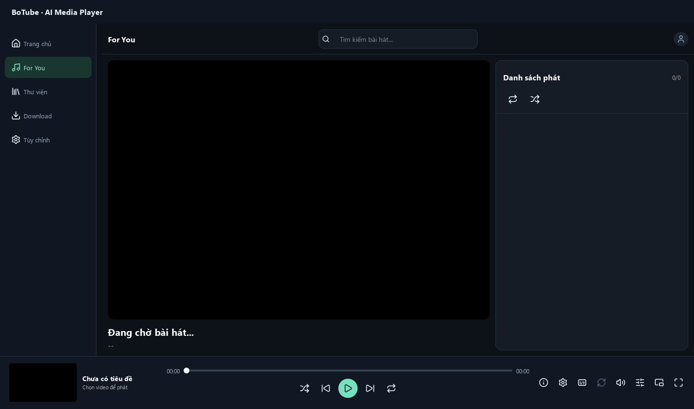
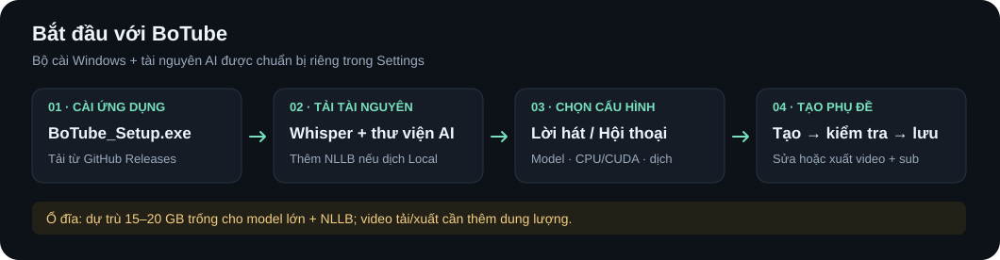

# BoTube · AI Media Player

**Tiếng Việt** · [English](README.en.md)

BoTube là ứng dụng phát nhạc và video trên Windows, kết hợp thư viện media, tải nội dung, tạo phụ đề bằng AI, dịch thuật và chỉnh sửa phụ đề. Giao diện được xây dựng bằng Python và PySide6. Có thể cài ứng dụng bằng `BoTube_Setup.exe`; thư viện AI và model được tải riêng trong Settings.

README này mô tả bản mới nhất có hai chế độ **Lời bài hát** và **Hội thoại / Phim**. Các bản cũ có thể chưa có đầy đủ tính năng bên dưới.



*Minh họa được dựng từ các thành phần giao diện thật với danh sách phát trống; không sử dụng thư viện nhạc hoặc dữ liệu cá nhân.*

## Tính năng

- **Phát media:** thư viện theo thư mục, tìm kiếm, trang For You, hàng đợi phát, shuffle, lặp, toàn màn hình và mini player.
- **Tạo phụ đề AI:** nhận dạng ngôn ngữ và nội dung bằng faster-whisper, hỗ trợ CPU hoặc GPU NVIDIA.
- **Dịch thuật:** dịch Local bằng NLLB-200 hoặc Online qua Google Gemini, OpenAI và Claude; chọn model theo nhà cung cấp trong Settings.
- **Hiển thị phụ đề:** chọn nội dung gốc, tiếng Anh, tiếng Việt hoặc kết hợp; chỉnh font, màu, vị trí và hiệu ứng chữ. Các hiệu ứng phi tiêu, sao, cánh hoa, typography và ẩn chữ sau vệt quét là tùy chọn.
- **Chỉnh sửa phụ đề:** sửa nội dung và mốc thời gian, nhập/xuất JSON, SRT, ASS; luồng tạo AI còn xuất lời gốc thành SRT và LRC.
- **Xuất video kèm phụ đề:** ghi phụ đề đang hiển thị vào video, chọn canvas, tỉ lệ, độ phân giải, FPS và chất lượng xuất.
- **Âm thanh:** ghi nhớ âm lượng, cân bằng độ lớn giữa các bài và các preset chất âm tùy chọn, bao gồm chế độ cho tai nghe.
- **Tải video và âm nhạc:** dùng yt-dlp, chọn định dạng và chất lượng trong giao diện tải xuống.

Thư viện hiện quét các đuôi `.mp3`, `.mp4`, `.mkv`, `.wav`, `.mov` và `.avi`. Khả năng phát một file cụ thể còn phụ thuộc codec và bộ giải mã.

## Bắt đầu sử dụng

### Cài đặt bằng BoTube_Setup.exe

**[Tải BoTube_Setup.exe](https://github.com/Diablo-Loc/App-AI-media-player/releases/latest/download/BoTube_Setup.exe)** · [Xem các bản phát hành](https://github.com/Diablo-Loc/App-AI-media-player/releases)

1. Vào **Releases**, chọn bản muốn dùng và tải `BoTube_Setup.exe` trong phần **Assets**.
2. Chạy bộ cài, hoàn tất các bước cài đặt Windows như thông thường, rồi mở BoTube từ shortcut đã tạo.
3. **Trước lần tạo sub AI đầu tiên**, mở **Tùy chỉnh → Tải / Cập nhật Resource AI (Thư viện & Model)**. Chọn model Whisper và bấm **Bắt đầu cài đặt tự động**; chờ thư viện và model tải/cài xong.
4. Nếu muốn dịch Local, chọn tải kèm **Model dịch thuật NLLB Offline**. Dịch Online vẫn cần Whisper trên máy để nhận dạng lời; NLLB cũng cần thiết nếu muốn dùng fallback Local khi API lỗi.
5. Quay lại Settings, chọn **Whisper Model** đã tải, **Compute Device** (`cpu` hoặc `cuda`) và **Loại nội dung** phù hợp, rồi **Lưu cài đặt**.
6. Chọn **Local Default** hoặc dịch vụ Online. Với Online, chọn model dịch và nhập API key của bạn.
7. Chọn thư mục chứa media, chọn bài/video và tạo phụ đề AI; mở công cụ phụ đề để kiểm tra, sửa hoặc xuất kết quả.

Người dùng bản cài đặt không cần clone repository hoặc tự build ứng dụng. Cài xong app và chuẩn bị xong tài nguyên AI là hai bước riêng; cần kết nối mạng khi tải tài nguyên lần đầu.



### Nếu dùng bản portable

Giải nén toàn bộ gói vào thư mục có quyền ghi, chạy `BoTube.exe`, rồi chuẩn bị tài nguyên AI và chọn cấu hình theo hướng dẫn ở trên.

Giữ nguyên cả thư mục portable, đặc biệt `_internal/`, `bin/`, `icon/` và tài nguyên AI đi kèm. Không chạy hoặc phân phối riêng mỗi file EXE.

Phát media từ bản EXE dùng bộ runtime đóng gói. **Cài mới thư viện AI từ trình tải tài nguyên trong EXE hiện cần Python trong PATH**; nên dùng Python 3.11 64-bit. Nếu gói đã kèm bộ thư viện/model AI tương thích thì không cần bước cài mới đó.

### Lưu ý dung lượng ổ đĩa

**Dung lượng bộ cài không phải tổng dung lượng sau khi chuẩn bị AI.** Bộ cài v5.0.0 hiện khoảng **306 MiB**; thư viện AI, Whisper, NLLB và cache được lưu thêm sau đó. Xem kích thước bộ cài của từng bản trong [Releases](https://github.com/Diablo-Loc/App-AI-media-player/releases).

- Nên dự trù khoảng **15–20 GB trống** nếu dùng một model Whisper lớn và NLLB Local, để có chỗ cho dữ liệu tải tạm và giải nén. Đây là mức dự trù, không phải dung lượng cố định hoặc yêu cầu tối thiểu cho mọi cấu hình.
- Model Whisper nhỏ cần ít dung lượng hơn; tải thêm nhiều model sẽ cộng dồn dung lượng. Bộ thư viện AI riêng cũng có thể chiếm nhiều GB.
- Tài nguyên nằm trong `app_resources/` cạnh ứng dụng, nên ổ chứa thư mục cài đặt cần đủ chỗ trống và quyền ghi.
- Cache âm thanh xử lý có ngân sách khoảng **1 GiB**. Video tải xuống và video xuất kèm sub cần thêm dung lượng tại thư mục lưu bạn chọn; file kết quả có thể lớn hơn file nguồn.

Dung lượng ghi trong giao diện là ước lượng; dung lượng tải và dung lượng sau giải nén có thể khác nhau. Xem lưu ý dung lượng ở trên trước khi cài bộ AI lớn.

### Chọn loại nội dung

| Chế độ | Phù hợp | Cách xử lý |
| --- | --- | --- |
| **Lời bài hát** · mặc định | Nhạc, MV, lyric video | Giữ luồng xử lý lyric: kiểm tra intro/thiếu lời, chia câu, căn mốc và prompt dịch lời hát. Genius có thể dùng để tham chiếu nếu bật. |
| **Hội thoại / Phim** | Hội thoại trong video hoặc phim | Chia câu theo từ, dấu câu và khoảng nghỉ; dùng mốc ASR, bỏ các bộ lọc credit/intro dành cho nhạc và Genius; dịch theo văn phong lời thoại. |

Lựa chọn này áp dụng khi tạo hoặc dịch phụ đề. Đổi chế độ không tự chuyển đổi hoặc căn lại phụ đề đã lưu. Chế độ hội thoại dùng chung Whisper, dịch vụ dịch và trình phát; chưa có tính năng nhận diện, gán nhãn riêng từng người nói.

### Chọn model và dịch vụ dịch

- **Whisper:** có `tiny`, `base`, `small`, `medium`, `large-v2` và `large-v3`. Model lớn thường cần nhiều tài nguyên hơn. Với lyric nhiều ngôn ngữ và ưu tiên chất lượng, có thể bắt đầu bằng `large-v3` nếu máy đáp ứng.
- **CPU / CUDA:** CPU dùng được khi không có GPU phù hợp; CUDA cần GPU NVIDIA và bộ thư viện/driver tương thích. Chọn CPU nếu gặp lỗi CUDA hoặc thiếu VRAM.
- **Local Default:** dùng NLLB-200 trên máy, không cần API key. Chỉ hoạt động offline khi thư viện và model cần thiết đã có sẵn.
- **Online:** nội dung phụ đề được gửi tới nhà cung cấp đã chọn. API key, quyền truy cập model, hạn mức và chi phí thuộc tài khoản của bạn; model có trong danh sách ứng dụng chưa chắc còn khả dụng cho mọi tài khoản.
- **Genius:** tùy chọn dành cho lời bài hát, dùng **Client Access Token**. Chỉ những tham chiếu vượt qua kiểm tra độ khớp mới được dùng; không có tham chiếu đủ tin cậy thì app tiếp tục dịch từ lời máy.

Một batch Online thành công thông thường dùng một yêu cầu dịch. Nội dung dài được chia batch có giới hạn; chỉ lỗi tạm thời hoặc thiếu ID mới kích hoạt lượt phục hồi có giới hạn. Khi Online thất bại, app giữ luồng fallback Local; fallback vẫn cần bộ NLLB tương thích.

### Phụ đề và xuất video

Hiệu ứng chữ chỉ thay đổi cách trình bày, không sửa nội dung hoặc mốc thời gian đã lưu. Vệt quét chạy theo thời lượng câu, không phải căn karaoke từng từ theo giọng hát.

Trong cài đặt phụ đề, chọn **Xuất video + lyric** để tạo video có phụ đề gắn vào hình. Có thể chọn tỉ lệ nguồn, 16:9, 9:16, 1:1 và các canvas khác; tùy chỉnh cách fit/fill, kích thước, FPS, vùng an toàn và một số thiết lập hiển thị riêng khi xuất.

Gắn phụ đề vào hình cần mã hóa lại video. Âm thanh ưu tiên giữ luồng nguồn; MP4 có thể chuyển sang AAC để tương thích. Bản xuất là file mới, không ghi đè video nguồn.

### Âm thanh

Cân bằng âm lượng và preset chất âm là tùy chọn; nguồn media gốc được giữ nguyên. Cân bằng âm lượng khi không bật EQ dùng gain trên đường phát hiện có. EQ có bước chuẩn bị nguồn phát riêng: đổi preset giữa bài có thể làm nạp lại nguồn và ngắt ngắn.

Cache nguồn phát đã xử lý nằm trong `storage/audio-playback-cache/`, có ngân sách khoảng 1 GiB; file đang dùng được bảo vệ nên mức chiếm dụng thực tế có thể vượt ngân sách. Cache này giúp tái sử dụng kết quả xử lý, không phải model AI hay bản sửa của file nhạc gốc.

## Phím tắt

Khi cửa sổ trình phát nhận phím:

| Phím | Thao tác |
| --- | --- |
| `Space` | Phát / tạm dừng |
| `F` | Bật / tắt toàn màn hình |
| `Esc` | Thoát chế độ toàn màn hình đang hoạt động |
| `←` / `→` | Tua lùi / tiến 10 giây |
| `↑` / `↓` | Tăng / giảm âm lượng |

## Chạy từ mã nguồn

Môi trường mục tiêu là **Windows 64-bit, Python 3.11**. Chuẩn bị [FFmpeg và FFprobe](https://ffmpeg.org/download.html): đặt `ffmpeg.exe`, `ffprobe.exe` trong `bin/` ở gốc dự án; khi chạy từ source, app cũng hỗ trợ tìm trong `app_resources/bin/` hoặc PATH.

Mở PowerShell tại gốc repository:

```powershell
py -3.11 -m venv venv
.\venv\Scripts\python.exe -m pip install -r requirements.txt
.\venv\Scripts\python.exe app/run_app.py
```

`requirements.txt` chứa dependencies ứng dụng; thư viện AI portable và các model cần được chuẩn bị riêng qua trình tải tài nguyên. Sau khi cài tài nguyên, lưu lựa chọn model/device trong Settings rồi tạo phụ đề.

Entry point hiện tại là `app/run_app.py`. Các thư mục tài nguyên lớn như `bin/`, `app_resources/` và media mẫu không đi kèm một bản clone mã nguồn thông thường.

## Dữ liệu và tài nguyên

```text
BoTube/
├── BoTube.exe                    # Có trong bản đóng gói
├── _internal/                    # Runtime của bản đóng gói
├── bin/                          # FFmpeg, FFprobe
├── icon/
├── app_resources/
│   ├── libs/                     # Thư viện AI portable
│   ├── whisper_models/           # Model Whisper đã tải
│   └── translation_models/
│       └── nllb-200/             # Model dịch Local
└── storage/                      # Thư viện, phụ đề, tùy chỉnh và cache
```

Khi chạy từ source, `storage/` và `app_resources/` nằm ở gốc dự án; khi chạy EXE, chúng nằm cạnh EXE. Một phần tùy chỉnh AI/API được lưu bằng **QSettings của Windows**, nên sao chép thư mục portable sang máy khác không đồng nghĩa mọi setting và API key cũng được chuyển theo.

Sao lưu `storage/` và giữ media nguồn trước khi đổi bản phát hành. Có thể tái sử dụng `app_resources/` nếu bộ tài nguyên tương thích với bản app mới. Không đưa API key, token, dữ liệu cá nhân hoặc bộ model/cache lên GitHub.

## Đóng gói EXE

Build trên Windows, từ đúng mã nguồn của phiên bản muốn phát hành. Cần có FFmpeg/FFprobe trong `bin/`, icon, native DLL và các tài nguyên giao diện mà script kiểm tra.

```powershell
.\venv\Scripts\python.exe -m pip install -r requirements-build.txt
.\venv\Scripts\python.exe build_app.py --dry-run
.\venv\Scripts\python.exe build_app.py
```

Script xuất dạng **onedir**:

- Lần đầu: `dist/BoTube/BoTube.exe`.
- Nếu `dist/BoTube/` đã tồn tại: xuất vào `dist/release-<timestamp>/BoTube/BoTube.exe`, giữ bản cũ.
- Có thể dùng `--dist-dir` để chọn một thư mục xuất mới. Script in đường dẫn kết quả cuối cùng.

Build chỉ chuẩn bị thư mục AI rời, **không tự sao chép toàn bộ thư viện/model trong `app_resources/` vào gói phát hành**. Nếu muốn gói dùng AI ngay hoặc offline, bổ sung bộ tài nguyên tương thích vào thư mục BoTube trước khi phân phối. Không kèm `storage/` cá nhân.

Trước khi phát hành, chạy EXE từ thư mục đã đóng gói và thử phát media, tạo/lưu/mở lại sub ở hai chế độ, dịch Local/Online cần dùng và xuất video. `--dry-run` kiểm tra cấu hình/tài nguyên, không thay thế việc thử EXE thật.

## Cập nhật

Ứng dụng có chức năng kiểm tra cập nhật qua metadata `version.json` trên GitHub. Cơ chế này phụ thuộc gói cập nhật và helper tương ứng của bản phát hành; chạy build ứng dụng không tự tạo hoặc đăng gói cập nhật.

Với bản portable mới, có thể giải nén sang thư mục riêng và chuyển dữ liệu/tài nguyên tương thích sau khi sao lưu. Hướng dẫn hot-patch của các bản cũ không phải quy trình đóng gói bản ứng dụng hiện tại.

## Giới hạn hiện tại

- AI có thể nhận sai, thiếu chữ hoặc lệch mốc thời gian khi hát nhanh, luyến, nhạc nền lớn, giọng nhỏ hoặc nhiều người nói chồng nhau. Phụ đề tạo tự động cần được kiểm tra trước khi xuất bản.
- Chế độ hội thoại đã có kiểm tra chức năng và bảo toàn nhánh nhạc, nhưng chưa có benchmark phim thật đủ rộng để bảo đảm mọi tình huống.
- Chất lượng dịch phụ thuộc lời máy, ngôn ngữ và model/provider; tham chiếu Genius không thay thế việc kiểm tra kết quả.
- Tải nội dung và dịch Online phụ thuộc mạng, nguồn nội dung và dịch vụ bên ngoài. Lỗi 503 có thể là lỗi tạm thời; 401/404 cần kiểm tra key hoặc model thay vì chỉ chờ và gọi lại.
- Preset âm thanh không phục hồi chi tiết đã mất do nén codec. Khả năng offline, GPU và hiệu năng phụ thuộc bộ tài nguyên và phần cứng thực tế.

## Phát triển và kiểm thử

Mã nguồn chính nằm trong `app/`: `ai/` và `pipeline/` xử lý nhận dạng; `translate/` xử lý dịch; `subtitle/` và `core/` quản lý dữ liệu; `ui/`, `control/`, `download_core/` phục vụ giao diện, điều khiển và tải nội dung.

```powershell
# Kiểm tra tập trung cho chế độ nội dung và timing hiển thị
.\venv\Scripts\python.exe -m unittest tests.test_dialogue_mode tests.test_subtitle_display_timing -v

# Chạy toàn bộ bộ kiểm tra
.\venv\Scripts\python.exe -m unittest discover -s tests -v
```

Bộ kiểm tra còn chứa snapshot và hợp đồng từ các giai đoạn trước; không mặc định coi toàn bộ suite đã xanh. Unit test, kiểm tra Qt và benchmark từng mẫu không thay thế kiểm thử GPU, API, media thực tế và EXE.

Xem [tài liệu dự án](docs/README.md), [hợp đồng tính năng](docs/FEATURE_PARITY.md), [hướng dẫn kiểm thử](tests/README.md) và [quy tắc phát triển](AGENTS.md). Khi gửi báo lỗi, nêu phiên bản/commit, model/device, loại nội dung, bước tái hiện và mốc thời gian bị lỗi; loại bỏ key/token khỏi log.

## Giấy phép và tài nguyên bên thứ ba

Thư viện, model, bộ giải mã và icon có giấy phép riêng. Icon Lucide đi kèm theo [ISC License](app/ui/assets/icons/LICENSE). Model Local [NLLB-200 distilled 600M](https://huggingface.co/facebook/nllb-200-distilled-600M) được công bố theo **CC-BY-NC-4.0**; cần xem điều kiện của model khi dự định sử dụng hoặc phân phối thương mại.

Hiện repository chưa có tệp `LICENSE` ở gốc cho toàn bộ mã nguồn BoTube.
