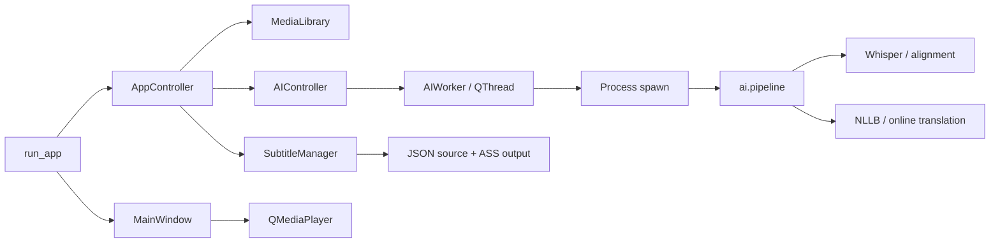

# Đánh giá và tái cấu trúc BoTube

> Người dùng đã khôi phục `app/` về code gốc ngày 03/10/2026. Inventory trước refactor vẫn dùng để đối chiếu; kết quả triển khai/test ở phần 7 là lịch sử, không còn là trạng thái app. Đánh giá hiện hành: [RESTORED_APP_REVIEW.md](RESTORED_APP_REVIEW.md).

Ngày đánh giá: 03/10/2026. Phạm vi: toàn bộ cây `app/`, gồm cả source bị Git ignore, các script build, dependencies, tài liệu và test liên quan ở gốc dự án. Số liệu bên dưới được chụp **trước refactor**.

Cập nhật sau rà soát tương thích: [PREVIOUS_REFACTOR_AUDIT.md](PREVIOUS_REFACTOR_AUDIT.md), [FEATURE_PARITY.md](FEATURE_PARITY.md), [ROADMAP.md](ROADMAP.md) và [PERFORMANCE.md](PERFORMANCE.md). Người dùng chọn giữ UI, ưu tiên kiến trúc/độ mượt. Số liệu gốc ở phần 8 được giữ để đối chiếu.

## 1. Kết luận

Nên tiếp tục với **ứng dụng desktop nguyên khối chia module theo tính năng**, dùng **MVP giản lược / UI–Controller–Service** với dependency injection ở điểm khởi động. Tách UI Qt khỏi nghiệp vụ có thể kiểm thử bằng Python thuần; giữ AI trong process riêng. Chưa có nhu cầu kỹ thuật để chuyển sang microservices, backend HTTP hoặc viết lại toàn bộ giao diện.

Code hiện tại có nhiều thành phần tái sử dụng được: thư viện media có cache, overlay subtitle, editor với undo, pipeline ASR/dịch, download và tích hợp media Windows. Vấn đề chính nằm ở ranh giới trách nhiệm và code cũ tồn tại song song. Đổi tên thư mục hàng loạt sẽ không giải quyết được các vấn đề này.

## 2. Phạm vi quét và hiện trạng

- Đọc và phân tích AST tất cả **87 file Python, 16.517 dòng** trong `app/`; thống kê symbol và import cho từng file.
- Kiểm tra cây thư mục thực tế, gồm `app/test/` bị `rg --files` mặc định bỏ qua vì rule `test/` trong `.gitignore`.
- Binary trong `app/bin/`, `app/download_core/yt-dlp.exe` và `app/native/AudioEngineNative.dll` được kiểm kê, không phân tích mã máy. Hai file trong `app/data/` được đọc kiểm tra định dạng. `__pycache__` là dữ liệu sinh ra, không phải nguồn.
- Kiểm tra entry point, wiring signal, process/thread, lưu JSON, đường dẫn portable, build và những API được gọi giữa module.
- Không tìm thấy `AGENTS.md` trong dự án hoặc các thư mục cha đã kiểm tra.
- Thay đổi của người dùng trước phiên: `requirements1.txt` đã sửa, `error_log.txt` đã xóa và `video/` chưa được Git theo dõi. Giữ nguyên.

### Cây chức năng ban đầu

```text
app/
├── run_app.py                 # Khởi động, môi trường, wiring, Qt
├── config.py, paths.py        # Cấu hình và đường dẫn portable
├── worker.py                  # QThread giám sát process AI
├── updater.py, downloader.py  # Update / tải model cũ
├── ai/                       # Pipeline thực + pipeline giả lập
├── control/                  # AppController, AIController, AIProcessManager
├── core/                     # Library, subtitle manager/renderer, Windows control cũ
├── download_core/            # yt-dlp, workers, cài AI runtime
├── bin/                     # FFmpeg/FFprobe/FFplay bản sao trong app
├── data/                    # Từ điển lyrics, bị Git ignore
├── job/                     # JobManager cũ + thumbnail worker khác
├── pipeline/                # Extract, ASR, alignment, lyric, VAD, vocal
├── subtitle/                # Models, storage/profile, converter, ASS
├── thumbnail/               # Manager và scanner
├── translate/               # NLLB, online providers, cache
├── ui/
│   ├── main_window.py        # 2.501 dòng; quá nhiều trách nhiệm
│   ├── media_player.py       # Player phụ chưa hoàn chỉnh
│   ├── system_media_manager.py
│   ├── pages/               # Library, ForYou, Download, Settings, MiniPlayer
│   ├── nav/
│   └── subs_ui/             # Overlay, editor, workers, I/O, settings
├── native/                  # DLL Windows
└── test/                    # Chủ yếu script chạy thử bằng GUI/AI
```

## 3. Luồng đang chạy



`job_manager` trong constructor cửa sổ thực tế nhận `AIController`, không phải class `JobManager`. Việc đặt tên này dễ khiến người sửa code chọn nhầm implementation.

## 4. Vấn đề có bằng chứng trong source

| Ưu tiên | Vị trí | Phát hiện và ảnh hưởng |
|---|---|---|
| P1 | Import trong toàn app; `download_source_app.py` | Trộn `control.*` và `app.control.*`. Cùng file có thể được nạp thành hai module, tạo hai resource cache. Chạy bằng `python -m` cũng không tương đương chạy file trực tiếp. |
| P1 | `ui/main_window.py` | 2.501 dòng: vừa layout, playback, playlist, quét folder, subtitle settings, fullscreen/mini, shutdown và tích hợp OS. Sửa một hành vi dễ ảnh hưởng nhiều phần. |
| P1 | `worker.py` | Queue tạo từ default context nhưng process dùng `spawn`; cleanup không nằm trong `finally` bao toàn bộ run; dựa vào `Queue.empty()` để kết luận process chết. Có đường lỗi bỏ lại process/queue hoặc mất kết quả. |
| P1 | `control/ai_controller.py` | Gắn xóa worker trước callback cleanup; callback thread cũ không phân biệt với thread mới; sau khi cài resource thành công chưa đồng bộ lại cờ của controller trước khi tiếp tục. |
| P1 | `translate/translator.py` | Workaround `check_torch_load_is_safe` là một phần tương thích runtime/model portable cũ. Giữ trong đợt bảo toàn hành vi; chỉ thay sau migration model/runtime và kiểm thử NLLB thực tế. |
| P1 | `core/media_library.py` | Default DB và `SubtitleManager()` dùng đường dẫn tương đối với cwd. Tự tạo một subtitle manager thứ hai chỉ để lấy media ID. Có thể lưu vào nơi khác khi chạy portable hoặc từ thư mục khác. |
| P1 | `core/subtitle_manager.py` | `_clean_segment` chỉ hiểu object: dict truyền vào `save_segments` bị đổi timing/text thành rỗng. Ghi JSON lỗi chỉ log rồi tiếp tục render, có thể báo hoàn tất khi source chưa lưu. |
| P2 | `config.py`, subtitle JSON/index | Ghi thẳng JSON; dừng giữa chừng có thể làm hỏng settings/source/index. Config merge không có lock giữa các thread. |
| P2 | `ui/main_window.py::sync_playlist_to_backend` | Dùng `app_controller.current_media` nhưng controller chỉ có `current_media_item`; kiểm tra `hasattr` vẫn cho qua khi controller bằng `None`. |
| P2 | `ui/media_player.py` | `self.video_widget` được dùng trước khi khởi tạo. Player thật lại được khai báo trong MainWindow. |
| P2 | `job/job_manager.py`, `ai/whisper_engine.py` | JobManager cũ gọi pipeline giả lập, tạo phụ đề mẫu. `stop()` có sentinel không gọi `task_done` rồi `Queue.join()`, có thể treo. Không nằm trên entry point hiện tại. |
| P2 | `control/ai_process_manager.py` | Import torch ở main process; nối signal `QThread.finished()` không có dữ liệu vào slot `(media_id, segments)`. Không nằm trên entry point hiện tại. |
| P2 | `downloader.py` | Import `models_dir` không tồn tại; hàm download chỉ in thông báo, chưa tải. Không thấy caller trong luồng hiện tại. |
| P2 | `subtitle/model.py`, `models.py`, `storage.py`, `profile.py` | Model và persistence có nhiều phiên bản; đơn vị thời gian giây/millisecond khác nhau giữa pipeline, JSON và editor. Cần schema/adapter rõ trước khi hợp nhất. |
| P2 | `subtitle/storage.py::load_subtitles` | Khởi tạo `SubtitleStyle` với `alignment` và `margin_v`, nhưng dataclass hiện tại không có hai field này; cũng giả định style là dict trong khi model chính dùng string. Loader này cần migration riêng. |
| P2 | `ai/pipeline.py`, translator và resource installer | Tự tính root từ `__file__` ở nhiều chỗ; root bundle `_internal` có thể khác nơi đặt portable models cạnh exe. |
| P2 | `ui/main_window.py::closeEvent` | Shutdown gom mọi việc trong một try; lỗi sớm có thể bỏ qua cleanup sau. Fallback terminate QThread và dọn temp cần chuyển về owner từng tác vụ. |
| P2 | `requirements.txt`, `requirements1.txt` | Hai danh sách dependency; manifest chính thiếu torch và một số thư viện được module phụ import. Cần tách runtime UI, AI và build với Python/CUDA mục tiêu. Chưa xác minh khả năng cài toàn bộ lockfile. |
| P3 | `.gitignore`, `app/test*` | Test ngoài `app` và cả `app/test` có file bị ignore. Nhiều file là demo khởi động Qt/GPU, chưa phải test hồi quy tự động. `test_build_app.py` đổi `sys.frozen` và `sys.executable` ngay khi import. |
| P3 | `app/data/common_lyrics_terms_1.json` | File mang đuôi JSON nhưng chứa đoạn code Java. Không phải dictionary hợp lệ; chưa thấy caller cần file này, giữ nguyên để người dùng đối chiếu. |

Ghi chú: lỗi style trong `LOGIC_CHECK.md` đã được sửa ở `subtitle/converter.py` hiện tại. Tài liệu cũ không thể dùng làm bằng chứng rằng mọi luồng đang chạy đúng.

## 5. Mô hình đề xuất và quy tắc phụ thuộc

```text
app/
├── bootstrap/               # Runtime setup + composition root
├── playback/                # Qt playback adapter + playlist thuần Python
├── media/                   # Media model / identity / library use cases
├── infrastructure/          # JSON I/O, paths, process adapters
├── control/                 # Điều phối use case; dần bỏ trực tiếp tạo dialog
├── subtitle/                # Schema, converter, persistence, render/export
├── ai/, pipeline/, translate/
├── download_core/, thumbnail/
└── ui/                      # View/widgets; phát request, nhận state
tests/                       # Test tự động không bị Git ignore
tools/                       # Audit / hỗ trợ development
docs/                        # Kiến trúc và quyết định
```

- **UI** quản lý widget/layout và event. Presenter/controller cập nhật view, không để view gọi GPU hay dịch trực tiếp.
- **Controller/use case** nhận dependency qua constructor. Không khởi tạo một service thứ hai trong service khác.
- **Domain** như media identity/playlist/subtitle schema không import Qt, torch, requests.
- **Infrastructure** thực hiện lưu file, ffmpeg, model/provider, OS; thay được trong test.
- **Composition root** tạo các instance duy nhất và nối signal ở startup.
- **Concurrency**: Qt UI chỉ ở main thread; I/O qua worker; AI qua process spawn. Owner phải hủy và chờ tài nguyên do mình tạo.
- **Persistence**: giữ nguyên định dạng JSON và thuật toán media ID trong đợt này để tránh mất liên kết subtitle/cache. Chuyển schema cần migration riêng.

## 6. Kế hoạch và phạm vi thực hiện

Đợt nền tảng trong phiên này: chuẩn hóa package/import, entry point ít side effect, runtime setup dùng chung, tách playback engine, logic playlist và subtitle appearance presenter, bỏ phụ thuộc SubtitleManager khi lấy media ID, sửa JSON lưu nguyên tử và sửa cleanup AI. Thêm test hành vi và kiểm tra import bằng AST.

Các phần tiếp theo cần thực hiện theo tính năng, với kiểm thử GUI/AI thực tế:

1. Tách library scan/filter/grid khỏi MainWindow: `LibraryController` và view riêng; ffprobe không chạy đồng bộ trên UI.
2. Tách mini/fullscreen sang `WindowModeCoordinator`; subtitle appearance đã có controller riêng trong đợt này. Tiếp tục giảm MainWindow về phần tạo view và nối request.
3. Chuẩn hóa schema subtitle, adapter giây ↔ millisecond và một repository; kiểm tra nhập/xuất SRT/ASS/LRC, timing và undo.
4. Hợp nhất thumbnail scheduling; chuyển resource installer UI khỏi AIController; dùng state/progress/failure thống nhất.
5. Xác minh caller của các implementation cũ, chuyển demo ra ngoài runtime rồi loại bỏ code không dùng. Không xóa chỉ vì không thấy import tĩnh.
6. Khóa môi trường Python/UI/AI/build, smoke test Windows, CUDA/CPU, cancellation, portable exe và update.

Các module cũ `JobManager`, `AIProcessManager`, downloader và model subtitle phụ được giữ để đối chiếu, chưa được coi là API cho tính năng mới. Không quảng bá pipeline giả lập thành pipeline production.

## 7. Kết quả refactor và kiểm chứng

### Đã thực hiện

| Phần | Kết quả |
|---|---|
| Package | Thêm `__init__.py`, thống nhất import `app.*` trên toàn app và demo được theo dõi trong Git. Không duy trì hai tên module cho cùng source. |
| Startup | `run_app.py` trở thành entry point nhỏ; `bootstrap/runtime.py` chuẩn bị môi trường trước `freeze_support`, `bootstrap/application.py` tạo và gắn các service. Hỗ trợ `python -m app` và entry point file cũ. Import entry point không nạp Qt/torch hoặc thay exception hook/môi trường. |
| Playback | `playback/engine.py` là engine chung; player phụ được sửa khởi tạo video output đầy đủ. |
| Playlist | `playback/playlist.py` giữ object/equality như `list.index` cũ, vẫn repeat-all; sửa callback dùng field `current_media` không tồn tại. |
| Subtitle appearance | Tách presenter `control/subtitle_appearance.py`; giữ tham chiếu config nhất quán sau reset, cập nhật outline/shadow bằng một lần lưu. |
| Persistence | `infrastructure/json_store.py` ghi nguyên tử với retry Windows; settings store cập nhật từng section để Download không ghi đè appearance mới. Áp dụng cho config, library, subtitle source và index. |
| Media | `media/models.py` và `media/identity.py` dùng chung; MediaLibrary không tạo thêm SubtitleManager. Giữ nguyên thuật toán ID cũ, root storage không phụ thuộc cwd. |
| Subtitle | Hỗ trợ cả object và dict khi lưu; giữ timing của dict trên vòng đọc/lưu lại. Lỗi lưu source không tiếp tục render hoặc báo thành công. |
| AI lifecycle | Queue, Event và Process đều từ spawn context; cleanup luôn chạy trong `finally`; bỏ `Queue.empty()` và sleep giả. Chặn kết quả muộn sau hủy và signal của worker cũ. |
| Portable | Dùng chung đường dẫn resource cạnh exe cho ASR và installer; bổ sung `models_dir()` để import module downloader cũ không còn thiếu symbol. Downloader vẫn chưa triển khai tải thực. |
| Translation | Khôi phục workaround NLLB cũ sau rà soát tương thích; chưa nâng runtime/model. |
| Library responsiveness | Scan/ffprobe chuyển sang worker có latest-request và shutdown; thumbnail batch flush, restart không wait trên GUI. Chi tiết và số đo trong `PERFORMANCE.md`. |
| Build config | Thêm project root vào search path của PyInstaller. Không chạy các script build có thao tác xóa output cũ. |
| Development | Thêm `tools/audit_app.py`, bộ test `tests/` và hướng dẫn chạy trong README. |

### Kiểm thử đã chạy

```powershell
.\venv\Scripts\python.exe -m unittest discover -s tests -v
```

Đợt nền tảng đầu có **38/38 test pass trên Windows, Python 3.11.0 / PySide6 6.10.1**, không skip. Đợt bổ sung có thêm contract differential/worker tests; kết quả cuối xem `PERFORMANCE.md`. Bộ kiểm chứng nền tảng gồm:

- Cú pháp/import canonical cho toàn bộ source và entry point không side effect khi import.
- Media ID tương thích cache cũ; đọc/lưu subtitle ba ngôn ngữ và chuyển thời gian cho UI.
- JSON không mất dữ liệu cũ khi serialization/replace thất bại; các section settings không ghi đè nhau; merge config từ nhiều thread.
- Playlist repeat-all và vị trí bài được giữ khi metadata được tạo lại.
- Worker spawn/cancel/cleanup/error, signal từ worker cũ và cập nhật cache sau cài resource.
- Process **spawn thật** gửi object Subtitle về main process; bài test dùng dữ liệu mẫu, không chạy Whisper.
- Tạo cửa sổ chính với dependency wiring thật, thay đổi/reset appearance và đóng cửa sổ ở chế độ Qt offscreen. DLL audio được mock; settings dùng thư mục tạm.
- Đường dẫn asset/model khi frozen và portable paths được chuẩn bị trước spawn bootstrap.

`git diff --check` đã pass. Bản Python 3.11 của venv hoạt động; sandbox mặc định chặn truy cập tới bản cài bên ngoài workspace, nên kiểm thử cuối chạy qua quyền thực thi mở rộng đã được automatic review cho phép. Không thay đổi bản cài Python hoặc dependencies của người dùng.

### Giới hạn và việc còn lại

Đây là **đợt refactor nền tảng**, chưa phải hoàn tất mọi mục ở phần 6. MainWindow vẫn còn lớn; phần library/grid, mini/fullscreen và shutdown cần tách tiếp. Các class AI/thumbnail/model cũ được giữ để đối chiếu caller trước khi xóa. Loader subtitle legacy và schema chưa được hợp nhất.

Chưa chạy Whisper/NLLB/GPU, gọi provider online, tải yt-dlp qua mạng, playback một video thực, native audio DLL hoặc build/update bản EXE. Test offscreen xác minh wiring và logic, chưa thay thế kiểm thử trực quan hoặc end-to-end các tính năng này.

Trong phiên có phát sinh việc `Bugs.txt` bị xóa ngoài các thao tác refactor; giữ nguyên trạng thái đó cùng các thay đổi của người dùng đã có trước phiên.

## 8. Kiểm kê source trước refactor

| File | Dòng | Class / hàm cấp module |
|---|---:|---|

| `app/ai/pipeline.py` | 385 | fix_nvidia_dlls, _check_cancel, _report, sanitize_filename, run_ai_pipeline |
| `app/ai/whisper_engine.py` | 27 | run_ai_pipeline |
| `app/config.py` | 53 | ConfigManager |
| `app/control/ai_controller.py` | 226 | AIController, _set_resource_cache_state, _get_resource_cache_state |
| `app/control/ai_process_manager.py` | 104 | AIProcessManager |
| `app/control/app_controller.py` | 267 | AppController |
| `app/core/media_control.py` | 58 | WindowsMediaManager |
| `app/core/media_library.py` | 255 | MediaMetadata, MediaLibrary, get_raw_metadata |
| `app/core/subtitle_manager.py` | 368 | SubtitleStatus, SubtitleRequestResult, SubtitleManager |
| `app/core/subtitle_renderer.py` | 68 | ASSRenderer |
| `app/download_core/download_source_app.py` | 593 | PipDownloadWorker, ResourceDownloadDialog, _set_resource_ready_flag, _get_resource_ready_flag, check_resource_status |
| `app/download_core/download_worker.py` | 295 | DownloadWorker |
| `app/download_core/get_title_worker.py` | 98 | GetTitleWorker |
| `app/download_core/utils.py` | 39 | sanitize_folder_name |
| `app/download_core/yt_dlp.py` | 52 | ensure_ytdlp_exists |
| `app/downloader.py` | 25 | download_model_if_needed |
| `app/job/job_manager.py` | 285 | WorkerSignals, ThumbnailWorker, JobManager |
| `app/job/job_state.py` | 9 | JobState |
| `app/paths.py` | 85 | project_root, input_dir, storage_dir, asset_dir, get_icon_path, get_input_path, init_folders |
| `app/pipeline/aligner.py` | 232 | has_japanese_chars, is_cjk, is_cjk_or_kr, visual_len, smart_join_buffer, is_duplicate_or_contained, clean_text_for_comparison, stabilize_initial_segment, refine_segments |
| `app/pipeline/asr_engine.py` | 34 | ASREngine |
| `app/pipeline/extractor.py` | 57 | extract_audio |
| `app/pipeline/forced_aligner.py` | 9 | align_with_lyrics |
| `app/pipeline/jp_normalizer.py` | 101 | is_cjk, universal_text_reconstruct, normalize_japanese |
| `app/pipeline/lyric_corrector.py` | 132 | correct_raw_segments_online |
| `app/pipeline/lyric_formatter.py` | 42 | format_time_srt, format_time_lrc, export_srt, export_lrc |
| `app/pipeline/postprocess.py` | 43 | load_dictionary, apply_dictionary, postprocess_segments |
| `app/pipeline/utils.py` | 99 | TempFileManager, is_connected, clean_song_title |
| `app/pipeline/vad.py` | 29 | VoiceActivityDetector |
| `app/pipeline/vocal_separator.py` | 53 | separate_vocals |
| `app/run_app.py` | 226 | global_exception_handler, setup_logging, check_system_dependencies, main |
| `app/subtitle/ass/ass_parser.py` | 56 | ASSParser |
| `app/subtitle/ass/renderer.py` | 96 | render_ass, _write_style |
| `app/subtitle/ass/style.py` | 28 | - |
| `app/subtitle/ass/utils.py` | 27 | sec_to_ass, _escape |
| `app/subtitle/config.py` | 45 | LineStyle, SubtitleConfig |
| `app/subtitle/converter.py` | 51 | refined_to_subtitles |
| `app/subtitle/engine.py` | 13 | add_translation, switch_top_language, clone_subs |
| `app/subtitle/mode.py` | 14 | SubtitleMode |
| `app/subtitle/model.py` | 31 | SubtitleStyle, SubtitleLine, Subtitle |
| `app/subtitle/models.py` | 13 | SubtitleLine, SubtitleSegment |
| `app/subtitle/profile.py` | 126 | SubtitleProfile, save_subtitles, load_subtitles |
| `app/subtitle/storage.py` | 143 | SubtitleProfile, save_subtitles, load_subtitles |
| `app/test/main.py` | 150 | fix_nvidia_dlls, main |
| `app/test/test.py` | 141 | ASSParser, MediaPlayerWrapper, MockMediaLibrary, MockJobManager, MockSubtitleManager, main |
| `app/test/test_ai.py` | 119 | MockSubtitleManager, fix_nvidia_dlls, test_run |
| `app/test/test_ai_controller.py` | 80 | main |
| `app/test/test_aligner_optimizations.py` | 17 | StabilizeInitialSegmentTests |
| `app/test/test_pipeline.py` | 17 | main |
| `app/test/test_sub.py` | 142 | KaraokeGhostFly |
| `app/test/test_worker.py` | 31 | main |
| `app/test_build_app.py` | 22 | - |
| `app/thumbnail/thumbnail_manager.py` | 131 | ThumbnailManager |
| `app/thumbnail/thumbnail_workers.py` | 48 | ThumbnailWorker |
| `app/translate/cache.py` | 75 | TranslationCache |
| `app/translate/nllb.py` | 31 | translate_nllb |
| `app/translate/online_logic.py` | 203 | fetch_lyric_genius, ask_ai_for_clean_title, translate_online_pipeline |
| `app/translate/pipeline.py` | 262 | TranslateMode, get_translator, clean_repetitive_text, run_safe_batch, translate_pipeline, clear_translator |
| `app/translate/translator.py` | 106 | NLLBTranslator |
| `app/ui/main_window.py` | 2501 | InternalMediaPlayer, MainWindow |
| `app/ui/media_card.py` | 299 | LoaderSignals, ImageLoader, MediaCard |
| `app/ui/media_player.py` | 90 | MediaPlayer |
| `app/ui/nav/sidebar.py` | 89 | Sidebar |
| `app/ui/pages/content_manager.py` | 120 | ContentController |
| `app/ui/pages/download.py` | 616 | SmartLinkPasteTextEdit, DownloadPage |
| `app/ui/pages/dynamic_island.py` | 274 | MiniPlayer |
| `app/ui/pages/for_you.py` | 794 | LazyThumb, VideoStage, ForYouPage, load_and_scale_image_rounded |
| `app/ui/pages/mode_manager.py` | 29 | BaseVideoPage, HomePage, LibraryPage |
| `app/ui/pages/settings.py` | 290 | SettingsPage |
| `app/ui/pages/settings_dialog.py` | 157 | SettingMenu |
| `app/ui/playback_bar.py` | 326 | PlaybackBar |
| `app/ui/styles.py` | 12 | - |
| `app/ui/subs_ui/lyric_settings_dialog.py` | 345 | SubtitleToolsDialog |
| `app/ui/subs_ui/sub_panel.py` | 360 | SettingsPanel |
| `app/ui/subs_ui/subtitle_commands.py` | 44 | ModelSnapshotCommand, InsertRowsCommand, RemoveRowsCommand, ReplaceSegmentsCommand, BatchShiftCommand, SplitRowCommand, MergeRowsCommand |
| `app/ui/subs_ui/subtitle_dialog_logic.py` | 1000 | SubtitleToolsDialogLogic |
| `app/ui/subs_ui/subtitle_editor.py` | 190 | SubtitleEditor |
| `app/ui/subs_ui/subtitle_io.py` | 159 | _parse_srt_time, _format_srt_time, _parse_ass_time, _format_ass_time, parse_srt_text, parse_ass_text, load_subs, save_subs |
| `app/ui/subs_ui/subtitle_layer.py` | 500 | DraggableSubtitle, SubtitleLayer |
| `app/ui/subs_ui/subtitle_model.py` | 176 | SubtitleTableModel, SnapshotCommand |
| `app/ui/subs_ui/subtitle_utils.py` | 29 | _parse_time_str, _format_time, _get_app_root |
| `app/ui/subs_ui/subtitle_workers.py` | 302 | AlignWorker, TranslationWorker, is_connected |
| `app/ui/system_media_manager.py` | 446 | SystemMediaManager |
| `app/ui/video_info_popup.py` | 342 | VideoInfoPopup |
| `app/ui/vol_panel.py` | 100 | VolumePopup |
| `app/updater.py` | 145 | download_and_install |
| `app/worker.py` | 215 | SafeStdout, AIWorker, _ai_process_wrapper |
