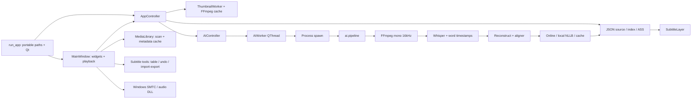

# Đánh giá bản app đã khôi phục

Ngày: 03/10/2026. Baseline: Git `4148c13` (BoTube v3.1.0), **app hiện tại được giữ nguyên**. Phạm vi lượt này: quét, phân tích, lập kế hoạch; không sửa tính năng, import, model, UI hay runtime.

## Kết luận

Giữ ứng dụng desktop hiện tại, chia module theo tính năng với UI–Controller–Service. Cây thư mục đã có phân vùng đủ dùng; không cần viết lại hoặc chuyển framework. Đáng tách nhất là các trách nhiệm đang dồn trong `main_window.py`, `subtitle_dialog_logic.py`, orchestration AI và resource installer. Việc tách file nhằm giảm rủi ro bảo trì; **không tự làm app nhanh hơn hoặc nhận diện chính xác hơn**.

Ưu tiên hiệu năng: giảm ghi cache lặp, tránh nạp model khi không cần dịch, giảm xử lý lặp trong editor, rồi đo scan/grid để quyết định có chuyển orchestration sang nền hay không. Ưu tiên độ chính xác: có bộ dữ liệu chuẩn, kiểm tra completeness của kết quả dịch và timestamp/schema; giữ ASR, prompts, heuristics và fallback hiện tại cho đến khi có đối chiếu đầu ra.

App đang chạy tốt theo xác nhận người dùng là chuẩn. Các điểm bên dưới là cơ hội tối ưu hoặc nhánh biên cần kiểm chứng, không phải kết luận app đang hỏng.

## Phạm vi và chứng cứ

- 87 file Python / 16.517 dòng; tất cả được đọc để phân tích AST/import/function/call và compile bằng Python 3.11.0 mà không import app.
- 92 file trong cây sau khi bỏ `__pycache__`: 87 source, 2 data, 1 yt-dlp EXE, 1 native DLL, 1 log. Binary chỉ kiểm kê, không chạy hoặc phân tích mã máy. Hai file data được xem nội dung.
- Đọc chi tiết các đường hoạt động chính: startup; chọn thư mục/bài; library/thumbnail; ASR/refine/translate; subtitle lưu/render/editor; download; native callbacks/window lifecycle.
- SHA-256 từng source, function/call/import và toàn cây: [restored-app-baseline.json](restored-app-baseline.json).
- Static import graph từ `run_app.py` đi tới 58 source; 29 source còn lại cần đối chiếu demo/dynamic imports trước khi quyết định. Có cạnh import không có nghĩa mọi hàm trong module được gọi.
- `git diff HEAD -- app` rỗng: source tracked trong `app/` khớp bản gốc lúc quét.
- Probe cô lập trên đoạn code nguồn tin cậy, API/settings giả lập: [restored-contract-probes.json](restored-contract-probes.json). Không gọi mạng, model, DLL hay registry.
- Không dùng kết quả 52 test hoặc benchmark 11,8x của bản refactor trước để kết luận về baseline đã khôi phục. Các test/tool cũ còn tham chiếu module đã bị rollback.
- Build config và README từ đợt trước vẫn còn ngoài `app/`; `requirements1.txt`, các file bị xóa và `video/` giữ nguyên. Không chạy build/updater hoặc dọn dữ liệu để làm audit.

Ký hiệu: **S** = chứng cứ source; **R** = tái hiện cô lập trên dữ liệu tổng hợp; **H** = giả thuyết cần profile/dữ liệu thật. Không có benchmark end-to-end trong lượt này.

## Luồng cần giữ



Đây là sơ đồ trách nhiệm, không phải mọi tín hiệu thời gian thực. Player chính là `InternalMediaPlayer` trong MainWindow; biến `job_manager` nhận `AIController`. `JobManager` trong `job/` không phải implementation đang được entry point lắp ghép.

## Phân tích từng thư mục

| Phần | Source / dòng | Quyết định cấu trúc | Tối ưu nên xem xét |
| --- | ---: | --- | --- |
| Gốc `app/` | 7 / 771 | Giữ entrypoint và đường dẫn; tách runtime chỉ sau có kiểm thử EXE | Đo startup; updater network ra nền nếu thực sự gây chờ |
| `ai/` | 2 / 412 | Giữ pipeline thật; tách stage runner có adapter | Ghi thời gian từng stage, peak RAM/VRAM; không đổi tham số để tiện refactor |
| `control/` | 3 / 597 | Giữ controller, làm rõ owner từng worker | Restart không block khi có chứng cứ chậm; stale result theo job identity |
| `core/` | 4 / 749 | Tách identity/model/repository dần, giữ re-export API | Library cache batching; metadata scan orchestration; dữ liệu save nhất quán |
| `thumbnail/` | 2 / 179 | Cấu trúc gọn, giữ manager/worker | Batch save, chống làm lại cùng ảnh, ưu tiên job đang cần sau khi đo |
| `translate/` | 5 / 677 | Giữ provider/model/cache; tách parser và contract kết quả | Lazy model sau cache miss; kiểm tra coverage kết quả; cache context có migration riêng |
| `pipeline/` | 11 / 831 | Đã tách tương đối tốt; không nhập các adapter cũ vào pipeline chính | Profile refine, giảm dựng lại chuỗi khi giữ output; đánh giá accuracy riêng |
| `subtitle/` | 8 / 436 | Chọn schema đang chạy làm chuẩn; adapters cho schema phụ | Chặn mất ngôn ngữ/timing trên round-trip; giữ đơn vị giây/ms |
| `subtitle/ass/` | 4 / 207 | Giữ render/export riêng | Golden output ASS/SRT; biên rounding và modes; không đổi style mặc định |
| `ui/` trực tiếp | 8 / 4.116 | Tách trách nhiệm của MainWindow, giữ widget/UI/API | Grid/card lifecycle, image jobs, native event volume; overlay lookup đã tối ưu |
| `ui/pages/` | 7 / 2.280 | Giữ pages và ContentController | For You highlight xa, search/rebuild/layout; giới hạn log nếu đo thấy cần |
| `ui/subs_ui/` | 10 / 3.105 | Tách playback sync, edit commands, storage binding khỏi logic dialog | Cache time index, undo RAM, round-trip và worker lifecycle |
| `ui/nav/` | 1 / 89 | Giữ | Chưa thấy điểm cần tách hoặc tối ưu ưu tiên |
| `download_core/` | 5 / 1.077 | Tách installer runtime khỏi download media khi làm lâu dài | Đo update/title/download riêng; preserve format/options/cancel |
| `job/` | 2 / 294 | Giữ để đối chiếu caller, không dùng làm nền cho pipeline mới | Chưa nằm trên graph entry chính; chưa có lợi ích runtime khi tối ưu trước |
| `test/` | 8 / 697 | Giữ demo; thêm characterization tests riêng cho baseline | Không chạy demo tự động vì có thể khởi tạo Qt/GPU/network |
| `native/` | DLL | Giữ ABI/export/lifetime callbacks | Đo callback rate, queue/drop, copy overhead trước khi thay |
| `data/` | 2 file | Giữ dữ liệu, không tự áp dictionary mới | Kiểm chứng caller/format; dictionary có thể thay lời nên cần reference |

### Gốc app: startup, paths, config, worker, updater

`run_app.py` đã thiết lập portable libs, PATH FFmpeg và freeze support; không bỏ các workaround/stdout guard khi chưa chạy bản EXE. `paths.py` phân biệt project root/assets và storage. Các import ngắn hoạt động theo entry script hiện tại; thống nhất `app.*` là một migration packaging, không phải tối ưu tốc độ nên không làm hàng loạt ở đợt đầu.

`config.py` merge config mới vào config cũ. Có thể trích một writer dùng chung cho settings/source khi đã có contract lỗi ghi; giữ schema/key/location. Không thay JSON bằng DB để “sạch” khi chưa đo quy mô/I/O. `updater.py` thực hiện requests và ZIP check trong hàm UI: S, có khả năng chờ nếu người dùng dùng updater; không chạy hoặc đổi trong audit.

`worker.py` giữ AI ở process spawn, giúp tách tài nguyên model khỏi UI. Đây là lựa chọn nên giữ. `stop()` có wait và cleanup process, `proxy_cancel_cb()` luôn False, có sleep 1 giây sau queue result: nên đo đường chuyển bài/hủy. Trên Windows default process context thường cũng là spawn; không xem sự khác cách tạo Queue/Process tự nó là bằng chứng app lỗi. Không bỏ sleep/terminate/queue handling khi chưa kiểm tra kết quả lớn và EXE.

### `core/`: library và subtitle storage

`media_library.py` giữ title/artist đã cache, chỉ probe lại duration 0; ID theo path đã resolve/lower + size. Giữ cả hai hợp đồng này. **Library gốc đã có save file tạm, replace, lock và retry Windows**; không cần viết lại cơ chế này chỉ để đổi kiến trúc.

S: `scan_folder` duyệt recursive, gọi ffprobe cho file mới; `MainWindow.load_folder_content` gọi nó đồng bộ (`main_window.py:1685`, call tại 1716). Timeout 3 giây là mỗi probe, không phải cả folder. Đây là ứng viên responsiveness khi folder lớn/cold cache; app chạy mượt với folder nhỏ/cache nóng vẫn phù hợp chứng cứ này.

S: `update_thumbnail_in_db` gọi `save()` sau mỗi ảnh; `save()` serialize mọi item. Với N metadata và M ảnh mới, tổng khối lượng serialization tăng theo N×M. Batch có thể giảm số lần ghi mà giữ kết quả cuối; cần flush hoàn tất/hủy và giữ source/settings người dùng ghi bền. Lock hiện chủ yếu bảo vệ save; chuyển scan sang nền cần kiểm tra mutation/snapshot trước, không bọc QThread rồi coi xong.

`SubtitleManager` là owner JSON/index/ASS của đường chính. Không gộp với `subtitle.storage` bằng cách đổi schema. Padding object -0.1/+0.1 giây ở `subtitle_manager.py:134` và giây→ms cho UI là contract. Trước khi sửa hỗ trợ đầu vào khác cần lập danh sách caller thật; editor đang dùng `save_raw_data`, không mặc định rằng mọi caller truyền dict vào `save_segments`.

### `thumbnail/`: ít cần tách, đáng tối ưu I/O

Đã có hai tầng cache: metadata path, rồi file ảnh; thứ tự embedded cover → frame giây 15 → frame giây 1. FFmpeg screenshot dùng fast seek trước input. Giữ ảnh, chất lượng, timestamp fallback và ID.

Đề xuất đầu tiên: trích persistence batching nhỏ, giữ API ghi ngay cho caller cũ. Benchmark cần cùng writer/same data; không dùng số đo bản refactor đã rollback. Cache RAM vẫn cập nhật ngay; cache disk flush cuối/cancel; crash recovery chỉ tác động cache có thể tạo lại. Restart thumbnail hiện stop+wait trong controller: chỉ đổi sang scheduling theo finished khi đã có bài kiểm tra owner/lifecycle, không chồng hai scanner.

### `ai/`: giữ model/process, tách runner có giá trị bảo trì

`ai/pipeline.py::run_ai_pipeline` dài 310 dòng, nhưng các stage nhận diện được: extract → model load/fallback → transcribe → reconstruct/refine → export → translate → cleanup. Tách runner/stage adapters có ích cho timing và tests; giữ hàm public và thứ tự. `ai/whisper_engine.py` là pipeline simulated, chưa nằm trên graph entry; không thay pipeline thật bằng tên class cũ.

Giữ chính xác default `medium`, device từ QSettings, compute float16/int8, transcribe `beam_size=3`, temperature 0, word timestamps, condition_on_previous_text=False, VAD off và prompt hiện tại. Không có chứng cứ để tăng beam, bật VAD hoặc thay model trong lượt này. Sleep 0.5 giây sau extract cần profile/kiểm tra lý do trước khi bỏ.

S: nhánh retry CUDA→CPU trong transcribe lấy `segments_generator, _`, trong khi `detected_lang` được gán ở nhánh thành công trước đó. Nếu lỗi xảy ra trước gán language, code phía sau có thể thiếu biến; cần tái hiện bằng lỗi giả lập tại đúng vị trí. Đây là nhánh biên, không phải kết luận luồng đang chạy bình thường bị lỗi. Giữ fallback order trong khi kiểm chứng.

### `pipeline/`: hiệu năng và accuracy phải có hai bộ đối chiếu

`extractor`, `aligner`, `jp_normalizer`, `lyric_formatter`, `utils` đã tách khá rõ. `refine_segments` gọi `smart_join_buffer`/`visual_len` lại cho từng word: S, ứng viên giảm dựng chuỗi nếu profile có tỷ lệ đáng kể. Tối ưu incremental length phải giữ cách nối CJK/Latin và output byte-for-byte trên fixture; không chỉnh ngưỡng để làm nhanh.

Heuristics bad words, fuzzy duplicate, giới hạn câu, overlap/SAFE_GAP và normalization có ảnh hưởng lời/timing. H: có thể cắt câu thật hoặc lặp điệp khúc tùy bài, nhưng cần ground truth để biết. Không xóa heuristics chỉ vì tên trông “hacky”. Phân biệt start_offset (đang trừ trong aligner), padding aligner và padding storage; không đảo dấu hoặc cộng thêm trong lúc di chuyển file.

`ASREngine`, VAD, Demucs/vocal_separator, postprocess dictionary và forced_aligner không được nối vào entry graph hiện tại. Không tự bật chúng để tăng độ chính xác; có thể thay chất lượng, tốc độ, RAM và yêu cầu tải model. Forced aligner hiện là placeholder, không phải tính năng đang hoạt động của luồng chính.

### `translate/`: hai đề xuất có ích rõ nhất

S: `translate_pipeline` tạo cache, gọi `get_translator()` tại dòng 175, rồi mới kiểm tra từng cache entry tại dòng 185. NLLB vẫn được khởi tạo khi tất cả text có cache. Đề xuất ưu tiên: hoàn tất phân loại cache trước, nạp translator khi có miss; giữ cache key, provider/mode, mapping dòng, batch 16/8 và generation parameters.

Cache key chỉ dựa trên stripped text (`cache.py::_key`). R xác nhận hợp đồng đó; thiếu language/mode/provider/model context có thể ảnh hưởng tính đúng khi chuyển ngữ cảnh. Chưa có chứng cứ cache của người dùng sai. Nếu cần cải thiện, dùng version/migration rõ; không rehash/xóa cache cũ tùy tiện.

R: online parser trả list truthy khi response tổng hợp không có dòng `ID===EN===VI` hợp lệ; zero rows được dịch nhưng nhánh main `if result` vẫn coi có kết quả. Đây là điểm ưu tiên kiểm tra completeness và fallback với API stub trước; sửa là cải thiện đường lỗi có chủ đích, không phải di chuyển code thuần.

S/R: `translate.pipeline` có một call truyền `src_lang` vào `translate_online_pipeline`, nhưng hàm online hiện không nhận keyword đó. **Main AI gọi online trực tiếp với signature hợp lệ**, nên không kết luận đường online chính hỏng. Cần test nhánh adapter này trước nếu muốn hợp nhất provider routing.

Cleaner có hard limit 150 ký tự, entropy/repetition filters; R cho thấy text tổng hợp dài bị rút xuống 153 ký tự tính cả ellipsis. Đây là hành vi hiện có, chưa chứng minh sai trên bài thật. Bộ accuracy cần câu dài, CJK không dấu cách và điệp khúc, trước khi đổi thresholds.

Giữ workaround transformers/NLLB hiện tại và models portable; không nâng dependencies hoặc chuyển model format trong tối ưu đầu tiên. Không bỏ empty_cache hoặc tăng batch chỉ dựa lý thuyết; đo throughput và peak VRAM trên cùng đầu ra trước.

### `subtitle/` và `subtitle/ass/`: giữ schema, thêm adapter khi đã biết caller

`subtitle.model` có top/middle/bottom, trong khi `models.py` có model top/bottom; `storage.py` và `profile.py` cũng chứa các định dạng khác nhau. S: loader storage giả định style dict/field không hoàn toàn trùng dataclass. Các hàm này nằm trong module được import không có nghĩa đều đang dùng; AI còn có import một số symbol không thực thi ở đường return hiện tại. Không xem schema phụ là lý do app chính chắc chắn mất dữ liệu.

Đề xuất: tài liệu hóa schema hiện hành + seconds/milliseconds, xác minh caller rồi thêm adapter, chưa đổi JSON đã lưu. Giữ `core/subtitle_renderer.py` và `subtitle/ass/renderer.py` đến khi có golden outputs theo từng mode, tránh gộp renderer làm mất style/language. Độ chính xác ở đây là text, ngôn ngữ và thời gian round-trip; không phải chất lượng dịch model.

### `ui/`, `ui/pages/`, `ui/nav/`

26 file UI, 9.590 dòng (~58% source). MainWindow 2.501 dòng chứa layout, player, folder/grid, subtitle appearance, window modes và native integration. Nên tách **trách nhiệm** theo thứ tự: library presentation → appearance binding → window modes → playback/native coordination. Giữ method wrappers và widget ownership; không đổi các timers phục vụ reparent/overlay theo cảm tính.

Những tối ưu đã có cần giữ: batch 12 card mỗi 10ms; resize thoát nếu số cột không đổi; `card_map` lookup; image decode nền với scaled size; cache và bỏ kết quả sai key; For You lazy thumbnails/batch, search debounce 300ms; watcher debounce 1.500ms.

Library grid cuối cùng vẫn tạo tất cả card, không phải virtualization. For You refresh có vòng while load đến vị trí đang phát (`for_you.py:488`), có thể tạo nhiều card cùng lượt nếu bài rất xa; H cần dataset lớn. Không chuyển model/view trước benchmark và đối chiếu click/highlight/search/shuffle/scroll.

ImageLoader nằm cùng MediaCard và được For You dùng lại; có thể tách module ảnh nhỏ để giảm phụ thuộc giữa view. Deduplicate job theo key hiện có, giữ crop/DPR/cache result. QPixmapCache global đang được đặt limit ở nhiều nơi (100/200 MiB); đo cache hit/RAM rồi thống nhất owner với behavior hiện tại. Không tự giảm quality hoặc đổi cache key để tiết kiệm RAM.

`subtitle_layer.py:360` **đã dùng bisect trên start times**, không quét tuyến tính mỗi frame. Giữ thuật toán đó. Có thể cache text theo cue+mode+style nếu đo thấy build/wrap tốn đáng kể; invalidate đúng khi chỉnh sửa/seek/mode/style. Không thay bằng index lookup có quy tắc overlap khác.

`system_media_manager.py` đã có queued bridge, bounded deque và copy native audio buffer. Giữ ABI và callback lifetime. Đo cb count/emit count/queue drops và overhead nếu audio dùng thường xuyên. `process_realtime_audio` trong MainWindow hiện placeholder; không tối ưu bằng bỏ buffer copy khi chưa biết lifetime bộ nhớ DLL.

`ui/nav`/playback/volume/mini UI nhỏ: chưa thấy nhu cầu tách thêm. Nhiều file nhỏ không tự giúp hiệu năng.

### `ui/subs_ui/`: điểm tối ưu dữ liệu rõ hơn overlay

`subtitle_dialog_logic.py` 1.000 dòng: playback context, highlighting, editing/undo, import/export, storage và AI actions. Đáng tách thành helpers giữ public methods; giữ model Qt hiện tại, shortcut, selection và undo.

S: `_sync_active_sub_for_time` ở dòng 266 đọc DisplayRole start/end, parse text và duyệt các row. Được gọi từ timer 200ms và signal position khi đã kết nối. Đề xuất: cache thời gian **với cùng precision/parse semantics đang hiển thị**, invalidate khi edit/insert/delete/paste/undo/redo/load. Không dùng float raw thay giá trị đã format nếu làm đổi biên highlight. Editor chọn row active đầu tiên theo thứ tự, overlay chọn cue theo bisect: không dùng chung thuật toán mù quáng với dữ liệu overlap/unsorted.

Snapshot undo sao chép toàn model trước/sau mỗi edit: H cần đo RAM với nhiều row/edit. Chỉ đổi sang delta command khi giữ mọi loại undo/redo và thao tác nhóm. Auto-scroll chỉ khi row đổi đã có, giữ.

R: `_format_srt_time(1.9996)` tạo `00:00:01,1000`, không carry sang giây tiếp. Đây là biên tổng hợp để bổ sung kiểm tra export chính xác; không kết luận SRT đang xuất thường xuyên lỗi. Giữ editor/model schema và nâng rounding trong một patch có fixture riêng nếu triển khai.

`TranslationWorker` của editor chạy QThread và có thể nạp NLLB trong process UI khác với AI process. Dialog đang disable nút khi dịch; không mặc định có hai job trong cùng dialog chạy song song. Cần kiểm tra đóng dialog/worker khi có tác vụ và tranh tài nguyên với AI chính trước khi gộp engine.

### `download_core/` và DownloadPage

Workers đã tách khỏi UI; giữ format/resolution/quality, rename, URL playlist, progress/log và cleanup hiện hành. `DownloadWorker.run` 234 dòng và `PipDownloadWorker.run` 221 dòng là hai quy trình khác nhau: tải media vs cài libs/models. Nên tách installer thành module runtime riêng về sau, không đổi layout bundle trong patch tối ưu media.

S: update yt-dlp chạy trước mỗi lượt download; cần kiểm tra `auto_update` được đọc có điều kiện hay không và đo phần đó riêng. Bật/tắt update là behavior của setting, không tự bỏ kiểm tra để tăng tốc. Title worker cũng có bước update/lookup; không chạy mạng trong audit.

Log emission theo dòng có thể làm UI bận ở download lớn; H đo signal count và thời gian append rồi mới batch/cap log. Dừng subprocess đang readline cần test bằng stub burst/quiet/hang và preserve cancel outcome. Không chạy cleanup_temp_files khi audit.

### `job/`, modules phụ, `test/`, `data/`, native binary

Các implementation cũ có thể phục vụ demo hoặc build/script khác: giữ, ghi rõ caller trước khi chuyển/xóa. `JobManager` gọi pipeline simulated và dùng Queue/thread khác đường AIController; hợp nhất tên class lúc này có rủi ro chọn nhầm pipeline. Tối ưu module chưa được dùng không cải thiện luồng chính.

`test/` chủ yếu GUI/AI demos; `test_build_app.py` thay frozen/executable ở top level, không import trong discovery baseline. `common_lyrics_terms.json` là dictionary; `_1.json` chứa Java, chưa thấy nối vào pipeline chính. Giữ để người dùng đối chiếu, không tự sửa/applied toàn bộ dictionary vào lời.

DLL/yt-dlp EXE: chỉ kiểm kê. Nâng bản nhị phân, ABI hoặc licensing là một hạng mục riêng, không phải phần audit hiệu năng này.

## Cấu trúc đích tối thiểu, chưa áp dụng

```text
app/
  run_app.py                         # giữ entrypoint
  control/                          # use cases + worker ownership
    library_controller.py           # nếu scan profile chứng minh cần nền
    subtitle_appearance.py          # presenter giữ API cũ
  core/                             # service/repository hiện tại, không đổi schema
  thumbnail/
    thumbnail_manager.py
    thumbnail_workers.py
    persistence.py                  # helper nhỏ khi triển khai batching
  ai/                               # pipeline facade + các stage đo được
  pipeline/                         # thuật toán hiện tại
  translate/                        # model/provider/cache + result validation
  subtitle/                         # models, contracts, adapters, ASS
  ui/
    main_window.py                  # compose view và adapters dần
    library_view.py                 # presentation grid nếu cần tách
    window_modes.py                 # sau khi kiểm tra mode/overlay/native
    image_loading.py                # shared loader giữ semantics
    pages/
    nav/
    subs_ui/                        # thêm playback sync/storage helpers dần
```

Không tạo cả cây mới trước rồi di chuyển đồng loạt. Không bắt buộc có `bootstrap/media/playback/infrastructure` mới để bắt đầu tối ưu. Có thể thêm khi trách nhiệm thực sự cần owner riêng; giữ re-export và đóng gói tương thích.

## Thứ tự triển khai đề xuất

| Bước | Phạm vi nhỏ | Chứng cứ phải có trước/sau | Trạng thái |
| --- | --- | --- | --- |
| 0 | Snapshot source, output/settings contracts, dataset | Baseline hiện tại + app thật/EXE trên máy người dùng | Source audit xong; actual-run baseline chưa đo |
| 1 | Lazy NLLB sau cache miss | Cùng en/vi/text/timing, số model init khi all-hit = 0, cache/schema giữ nguyên | Đề xuất, chưa sửa |
| 2 | Batch thumbnail persistence | Cùng ảnh/path/JSON cuối, write count, flush cancel/error/shutdown, không wait thêm | Đề xuất, chưa sửa |
| 3 | Cache timing cho editor | Row highlight giống trước với seek/overlap/unsorted/edits/undo, parse count giảm | Đề xuất, chưa sửa |
| 4 | Scan orchestration nếu profile cần | Same metadata/order/ID/user title, GUI heartbeat, latest request, concurrent save/shutdown | Đề xuất, chưa sửa |
| 5 | Precision/completeness fixes tách biệt | Golden corpus, API stub partial/duplicate/zero IDs, timestamp boundaries, fallback và migration rõ | Đề xuất, chưa sửa |
| 6 | Tách MainWindow/AI/dialog theo trách nhiệm | Same public API/signals/ownership/modes/EXE; timing/RAM nếu claim hiệu năng | Đề xuất, chưa sửa |

Mỗi bước có diff nhỏ và baseline comparison. Mọi đề xuất thay text/timing/provider/cache key mặc định là thay đổi hành vi cần quality gate riêng; không gắn nhãn “refactor” để bỏ qua gate.

## Kiểm chứng và giới hạn

Đã chạy `tools/audit_restored_app.py` bằng Python 3.11; 87 source compile thành công, baseline JSON ghi SHA và graph. Đã chạy probe offline về translation cache context, cleaner limit, parser zero-coverage, keyword adapter và SRT rounding. Đã kiểm tra cuối source hash và diff để xác nhận app không đổi.

Chưa chạy UI/media thật/EXE, GPU, provider online, download, native DLL hoặc load models; không có khẳng định tăng FPS/tốc độ ASR/độ chính xác hiện tại. Bản xuất chạy tốt do người dùng xác nhận được giữ làm baseline sản phẩm; audit source không thay thế xác nhận đó.

Hướng đo độ chính xác và tập media: [ACCURACY_BASELINE_PLAN.md](ACCURACY_BASELINE_PLAN.md). Trạng thái roadmap mới: [ROADMAP.md](ROADMAP.md). Docs/test/benchmark đợt trước được đánh dấu lịch sử, không coi là kết quả của code hiện tại.
